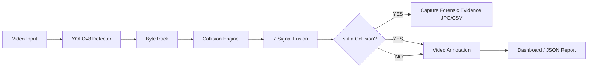

# 🚗 Project Crash AI - Forensic Collision Detection System

[](https://www.python.org/)
[](https://github.com/ultralytics/ultralytics)
[](https://arxiv.org/abs/2110.06864)
[](https://streamlit.io)

Project Crash AI is an advanced computer vision system designed for the **detection and forensic analysis of vehicle collisions** in traffic surveillance (CCTV) footage. Unlike simple detectors, this system employs a multi-signal kinematic fusion of 7 indicators to ensure academic-grade precision and minimize false positives.

---

## 🧐 What does it do?

The system processes traffic videos and performs the following tasks:
1. **Multi-Class Detection:** Identifies cars, buses, trucks, and motorcycles.
2. **Temporal Tracking:** Assigns a unique ID to each vehicle and maintains its history even during brief occlusions at the moment of impact.
3. **Collision Analysis:** Evaluates risk using a weighted formula that includes:
   - **TTC (Time-to-Collision):** Based on the **ISO 22839** standard.
   - **Velocity Variation:** Detects sudden deceleration post-impact (inelastic impact).
   - **Overlap (IoU):** Analyzes the intersection and proximity of detection boxes.
   - **Angular Change:** Detects abnormal trajectory deviations.
4. **Evidence Gathering:** Automatically captures the exact frame of the accident and generates detailed reports for forensic use.

---

## 🛠️ Tech Stack (What does it use?)

- **Computer Vision:** `Ultralytics YOLOv8` for state-of-the-art object detection.
- **Object Tracking:** `ByteTrack` for stable ID association and occlusion recovery.
- **Kinematic Logic:** Custom Python implementation for TTC and movement vector calculations.
- **User Interface:** `Streamlit` for an interactive analysis dashboard.
- **Data Analysis:** `Pandas`, `Plotly`, and `NumPy`.

---

## 🏗️ System Architecture

The data flow follows a modular pipeline:



---

## 🚀 How to Run

### 1. Prerequisites
You must have **Python 3.12** (or higher) installed. Using a virtual environment (Conda or venv) is highly recommended.

### 2. Install Dependencies
Run the following command in your terminal within the project folder:
```bash
pip install -r requirements.txt
```

### 3. Run the Dashboard (Web Interface)
To use the interactive interface and upload your own videos:
```bash
streamlit run app.py
```

### 4. Run via Console (CLI)
To process videos in bulk via command line:
```bash
python main.py --video ccd_crash_01.mp4
```

---

## 📥 What to Download?

1. **Python:** Download it from [python.org](https://www.python.org/).
2. **Models (Automatic):** The system will automatically download the `yolov8n.pt` weight file the first time you run it. You do not need to download it manually.
3. **Sample Videos:** Ensure your `.mp4` videos are placed in the `data/input/` directory.

---

## 📂 Output Structure (Evidence)

When an accident is detected, the system generates:
- **Processed Video:** Located in `data/output/` with highlighted collisions.
- **JSON Report:** Technical data of every detected crash.
- **Forensic Captures:** High-resolution `.jpg` images of the impact moment in `evidence/frames/`.
- **Event Log:** A cumulative `evidence/events.csv` file tracking all detected accidents.

---

## 📚 Academic References
- **ByteTrack:** Multi-Object Tracking by Associating Every Detection Box (ECCV 2022).
- **ISO 22839:** Intelligent transport systems — Forward vehicle collision warning systems.
- **CADP:** A Car Accident Detection and Prediction dataset for surveillance.

---
**Author:** Justin Gómez Coello
**Version:** 2.0 (Academic Grade)
